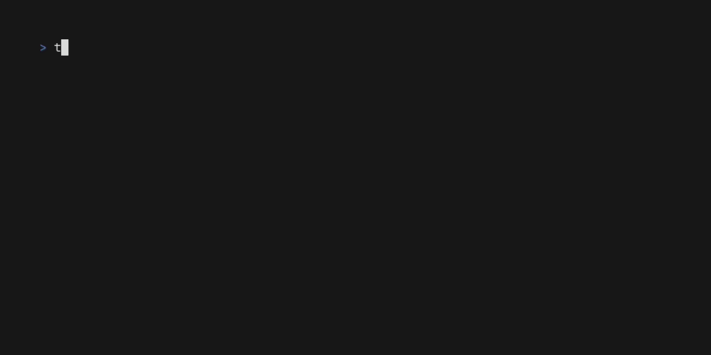

<a name="readme-top"></a>
<div align="center">
	<a href="./LICENSE">
		
	</a>
	<a href="https://github.com/LordOfTrident/telhub/graphs/contributors">
		
	</a>
	<a href="https://github.com/LordOfTrident/telhub/stargazers">
		
	</a>
	<a href="https://github.com/LordOfTrident/telhub/issues">
		
	</a>
	<a href="https://github.com/LordOfTrident/telhub/pulls">
		
	</a>
	<br><br><br>
	
	<h1 align="center">Telhub</h1>
	<p align="center">💬 A telnet chat server in Elixir 🧪</p>
	<p align="center">
		<a href="#demo">View Demo</a>
		·
		<a href="./todo.md">View TODO</a>
		·
		<a href="https://github.com/LordOfTrident/telhub/issues">Report Bug</a>
		·
		<a href="https://github.com/LordOfTrident/telhub/issues">Request Feature</a>
	</p>
	<br>
</div>

<details>
	<summary>Table of contents</summary>
	<ul>
		<li><a href="#introduction">Introduction</a></li>
		<li><a href="#demo">Demo</a></li>
		<li>
			<a href="#quickstart">Quickstart</a>
			<ul>
				<li><a href="#server">Server</a></li>
				<li><a href="#client">Client</a></li>
			</ul>
		</li>
		<li><a href="#bugs">Bugs</a></li>
	</ul>
</details>

## Introduction
A telnet chat server made in [Elixir](https://elixir-lang.org/). Built on top of my first server
app, [Telnexir](https://github.com/lordoftrident/telnexir).

## Demo
<p align="center">
	
</p>

## Quickstart
### Server
```sh
$ git clone https://github.com/LordOfTrident/telhub
$ cd telhub
$ mix run --no-halt -- [PORT] [PASSWORD]
```

`[PASSWORD]` is an optional server password.

> [!NOTE]\
> If you dont know what to pick for `[PORT]`, you can omit it. Default is `4040`.

### Client
```sh
$ telnet <IP> <PORT>
```

> [!NOTE]\
> If you are connecting from the same computer the server is running on, put `localhost` instead of `<IP>`.

## Bugs
If you find any bugs, please, [create an issue and report them](https://github.com/LordOfTrident/telhub/issues).

<br>
<h1></h1>
<br>

<div align="center">
	<a href="https://elixir-lang.org/">
		
	</a>
	<a href="https://en.wikipedia.org/wiki/Telnet">
		
	</a>
	<p align="center">Made with ❤️ love</p>
</div>

<p align="right">(<a href="#readme-top">Back to top</a>)</p>
